# React and Morty

> "The only way to learn a new programming language is by writing programs in it."  
> -- <cite>Dennis Ritchie</cite>

## What we are going to build

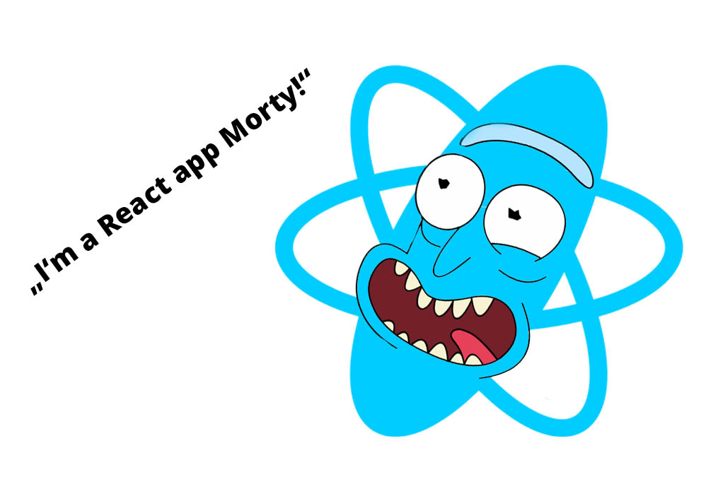

This repo contains the Rick and Morty in React exercise. Use this as a template.

We will create a React app to render characters from the Rick and Morty API. You will be able to save characters as favorites, see detailed information on a separate page and you can get random characters.

See a scribble for a simple overview:
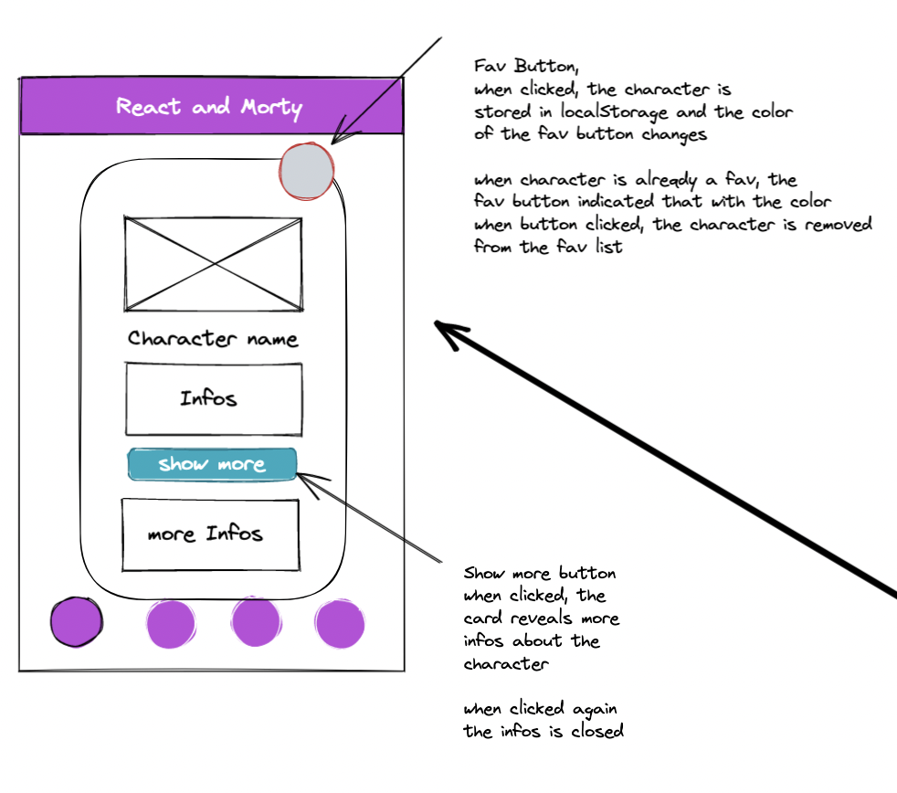
See final example app [here](https://react-and-morty-solution.vercel.app/)

## Learning Objectives

- git & GitHub workflow
- using [issues](https://docs.github.com/en/issues/tracking-your-work-with-issues/about-issues) and a [board](https://docs.github.com/en/issues/organizing-your-work-with-project-boards/managing-project-boards/about-project-boards) to organize tasks
- learn to build a multipage react application
- how to break down a big problem in solvable smaller problems
- coding, coding, coding

### You will use the following stack

- react with useState & useEffect hooks
- styled-components
- react-router
- ES6 Features
- fetching data from an external API
- storing data in localStorage
- logic

## How to get started?

We have created some issues for you. (You will learn how to import these into your own project (after using the template))

These issues, solved from 1 to 8, will help you to focus on one problem at a time.
After solving everyone of them the app should be „production“ ready and running.

Please read the issues carefully and if you have any questions, pls ask the coaches.

If you working on an issue, pls move the issue from the todo tab in the project board to the working on tab.

### Workflow step 1

- use this repo as a template and create an own project in your GitHub Account

- then clone the repo to your local machine

- create a board back on Github (in the repo)
- got to the `Projects` tabs
  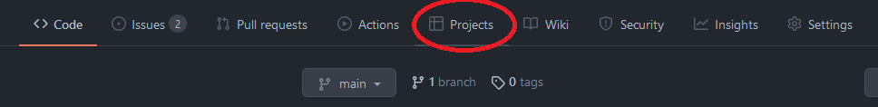
- choose `Projects` (not Projects beta) and click `New project`
  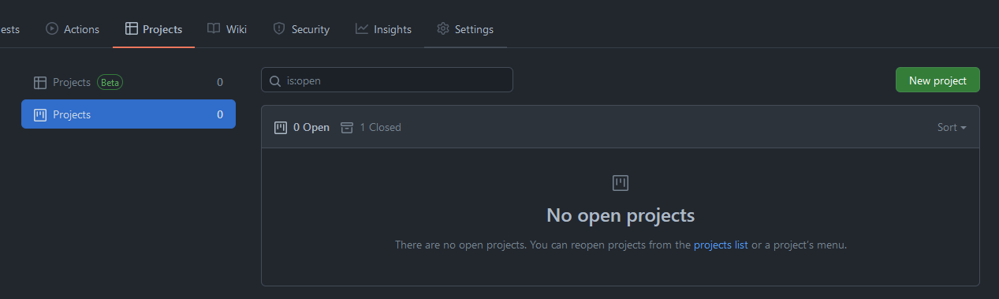
- give the board a meaningful name, like `Development` and choose as a `Project template` -> `Basic kanban`
  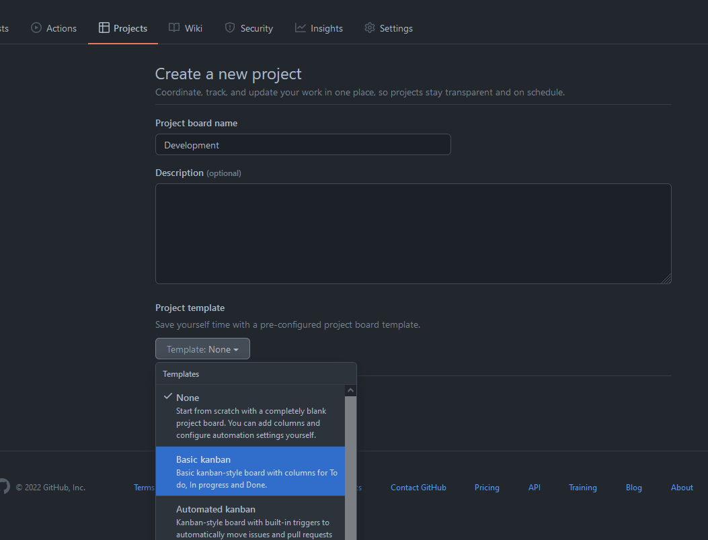
- click then `Create project`
- go now to the `Actions` tab
  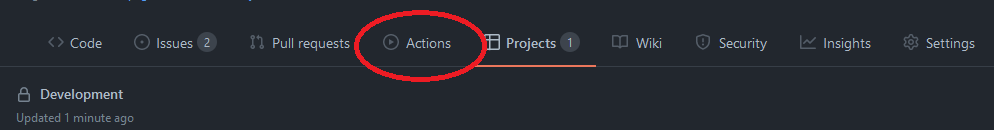
- click `Create all issues for the project` and then `Run workflow` and again `Run workflow`
  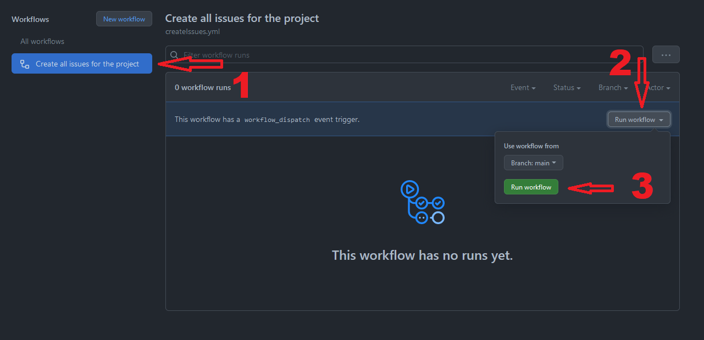
- this `action` creates all issues, you have to do
- under the `Issues` tab you should see now the number 8 (the image is just an example)
  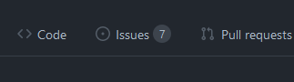
- go back to your `project kanban board` and click the `+ Add cards` button and move every issue with drag & drop into the `To do` column
  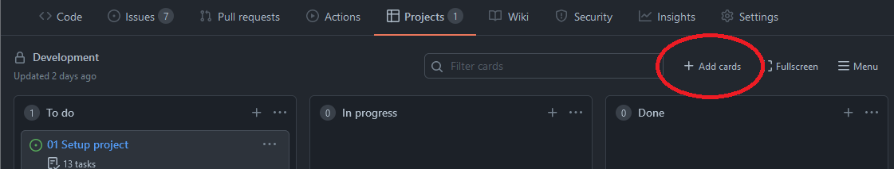
  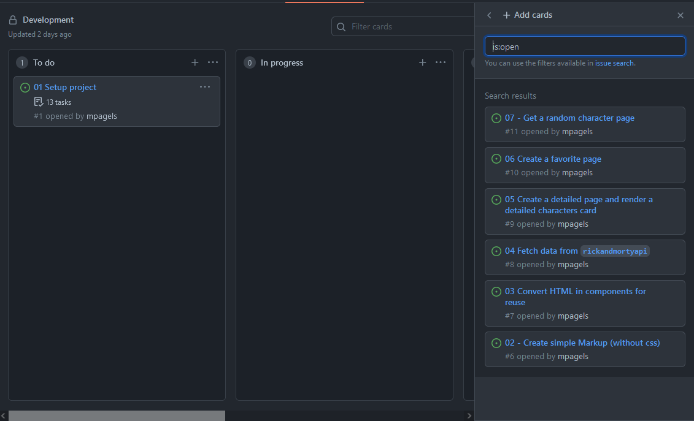
  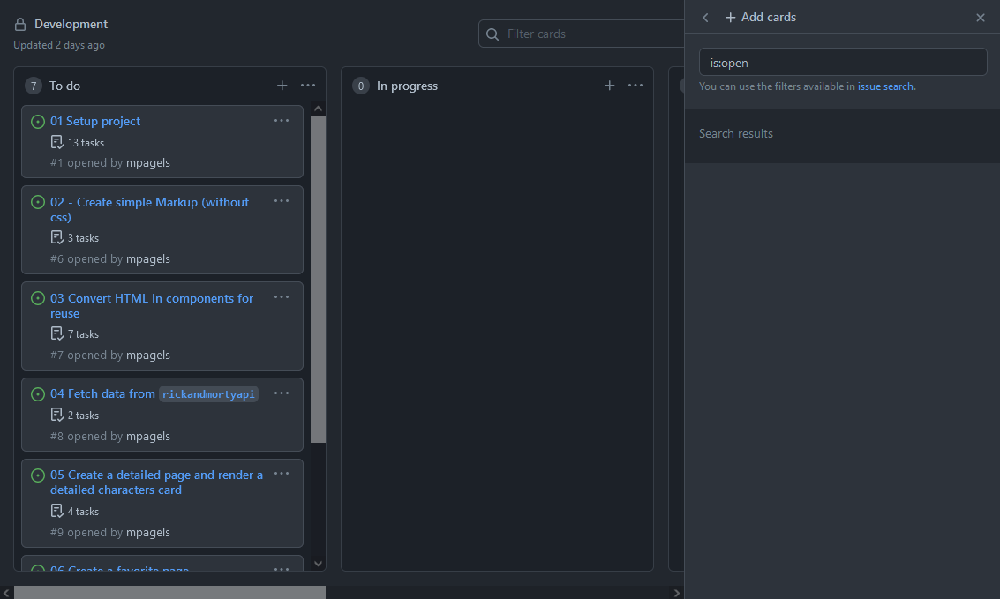

### Workflow step 2

- after doing [Workflow step 1](#workflow-step-1):
- read the issue carefully, best practice would be to start with #1 and do everything whats in there

- When you are ready, push the branch to Github and create a pull request, write a short description what was done here and then merge the branch into main.

- Move the issue you are have finished from the „in progress“ tab to the „done“ tab.

- Pull the main from the remote (GitHub) to your local machine.

- Start over with the next issue.

## Recources:

- [Rick and Morty API Docs](https://rickandmortyapi.com/documentation/#rest)
- [useState](https://reactwithhooks.netlify.app/docs/hooks-state.html)
- [useEffect](https://reactwithhooks.netlify.app/docs/hooks-effect.html)
- [react-router](https://reactrouter.com/docs/en/v6/getting-started/tutorial)

HAVE FUN

> "Wubba lubba dub dub"  
> -- <cite>Rick Sanchez</cite>
